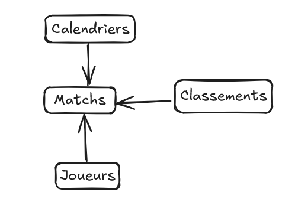

# DomainesApplicationStatistiques_TRG_MNR_RNT_SMN

```
TRUONG David 
MEUNIER Aubin 
RENAULT Thibault 
SAMAIN Jad
```

## Schéma de donnée


## Dictionnaires de données

- Saison : L'année ou la saison sportive à laquelle les données se réfèrent (par exemple, saison 2024-2025).
- Num_match : Le numéro ou l'identifiant du match dans la saison.
- Competition : Le nom de la compétition ou du tournoi dans lequel le match a eu lieu (ex : Ligue 1, EuroLeague).
- dom_ext : Indique si le match a eu lieu à domicile ("dom") ou à l'extérieur ("ext").
- Gagne_perdu : Résultat du match pour l’équipe (gagné ou perdu).
- Adversaire : Nom de l’équipe adverse.
- Capitaine : Indique si le joueur était le capitaine de l’équipe pendant le match.
- Starter/bench : Statut du joueur dans l'équipe, s’il a commencé le match (starter) ou s’il est resté sur le banc (bench).
- Joueur : Nom ou identifiant du joueur qui a participé au match.
- Minutes : Le nombre de minutes durant lesquelles le joueur a joué.
- Secondes : Le nombre de secondes durant lesquelles le joueur a joué (détail plus précis que les minutes).
- Secondes(minutes) : Conversion des secondes en minutes, généralement pour faciliter les calculs.
- Tps_jeu_decimal : Temps de jeu en format décimal (par exemple, 30 minutes 45 secondes seraient converties en 30.75 minutes).
- Tirs_marques : Le nombre de tirs réussis par le joueur.
- Tirs_tentes : Le nombre total de tirs tentés par le joueur.
- %Tirs : Pourcentage de réussite des tirs, calculé comme (Tirs_marques / Tirs_tentes) * 100.
- 2pts_marques : Le nombre de tirs à deux points réussis par le joueur.
- 2pts_tentes : Le nombre total de tirs à deux points tentés par le joueur.
- %2pts : Le pourcentage de réussite des tirs à deux points, calculé comme (2pts_marques / 2pts_tentes) * 100.
- 3pts_marques : Le nombre de tirs à trois points réussis par le joueur.
- 3pts_tentes : Le nombre total de tirs à trois points tentés par le joueur.
- %3pts : Le pourcentage de réussite des tirs à trois points, calculé comme (3pts_marques / 3pts_tentes) * 100.
- LF_marques : Le nombre de lancers francs réussis par le joueur.
- LF_tentes : Le nombre total de lancers francs tentés par le joueur.
- %LF : Le pourcentage de réussite des lancers francs, calculé comme (LF_marques / LF_tentes) * 100.
- Pts_apres_balles_perdues : Nombre de points marqués après une perte de balle par l’équipe adverse.
- Points_int : Points marqués après des interceptions.
- Point_2eme_chance : Nombre de points marqués suite à une deuxième chance (souvent après un rebond offensif).
- Points_CA : Points marqués en contre-attaque.
- Points_banc : Points marqués par les joueurs venant du banc.
- Ecart_max : L’écart maximum entre les deux équipes durant le match.
- Serie_max : La plus grande série consécutive de points marqués par l’équipe.
- Pts : Nombre total de points marqués par le joueur.
- RO : Nombre de rebonds offensifs captés par le joueur.
- RD : Nombre de rebonds défensifs captés par le joueur.
- RT : Total des rebonds (offensifs + défensifs) captés par le joueur.
- PD : Nombre de passes décisives réalisées par le joueur.
- BP : Nombre de blocks (contre) réalisés par le joueur.
- INT : Nombre d’interceptions réalisées par le joueur.
- CT : Nombre de fautes commises par le joueur.
- CTS : Nombre de fautes subies par le joueur.
- F : Nombre de fautes personnelles commises par le joueur.
- FPR : Le ratio de fautes personnelles commises par rapport à ses minutes de jeu.
- +/- : L'écart de points de l’équipe lorsque le joueur est sur le terrain, aussi appelé le "plus/moins" (différence entre les points marqués par son équipe et ceux marqués par l'adversaire pendant qu'il joue).
- EVAL : L’évaluation globale du joueur, souvent utilisée comme un indicateur de performance. Elle regroupe plusieurs statistiques de performance (points, rebonds, passes, etc.).
- N° : Le numéro du joueur
- JOUEUR : Le nom ou l’identifiant du joueur (peut être une version alternative ou un code du joueur).

## Problématique

**Quel style de jeu est le plus efficace en termes de victoire ?**

## Style de jeux

| **Style de jeu** | **Description**                                                           | **Indicateurs clés**                                       | **Forces**                                | **Faiblesses**                                |  |
| ---------------- | ------------------------------------------------------------------------- | ---------------------------------------------------------- | ----------------------------------------- | --------------------------------------------- | ----------------------- |
| **Offensif**     | Style axé sur la production de points, souvent à rythme élevé             | 🔹 **ORtg élevé**<br>🔹 Pace élevé<br>🔹 eFG% / 3PAr élevé | Créativité, spacing, efficacité offensive | Défense négligée, vulnérable dans les runs    
| **Défensif**     | Priorité à la défense, rythme plus lent, jeux structurés                  | 🔹 **DRtg faible**<br>🔹 Pace faible<br>🔹 OREB% / DREB% ↑ | Discipline, rebond, protection du cercle  | Manque de scoring rapide ou tir extérieur    
| **Équilibré**    | Solide des deux côtés du terrain, capable de s’adapter selon l’adversaire | 🔹 ORtg & DRtg tous les deux bons<br>🔹 Net Rating élevé   | Polyvalence, stabilité, adaptabilité      | Peu de failles mais parfois sans "punch" fort 

## Source des calculs des indicateurs
- https://basket-infos.com/2015/08/15/statistiques-avancees-le-lexique/
- https://viziball.app/glossary/nba/en
- https://www.basketball-reference.com/about/ratings.html 

## Calcul des indicateurs 
- Possession = 0.5 * (...) + BP
- Offensive rating = 100 * ( PTS / POSS)
- Defensive rating = 100 * (OppPTS / OppPOSS)
- NetRating = Offensive rating - Defensive rating 

## Interprétation des indicateurs
| **Indicateur**       | **Ce que ça mesure**                         | **Valeur élevée =**                              | **Valeur basse =** | **Interprétation rapide**                                |
| -------------------- | -------------------------------------------- | ------------------------------------------------ | ------------------ | -------------------------------------------------------- |
| **Offensive Rating** | Points marqués / 100 possessions             | Bonne attaque                                    | Attaque inefficace | Mesure l'efficacité offensive                            |
| **Defensive Rating** | Points encaissés / 100 possessions           | Mauvaise défense                                 | Bonne défense      | Plus c’est bas, mieux l’équipe défend                    |
| **Net Rating**       | ORtg – DRtg (diff. entre attaque et défense) | Équipe dominante (plus elle bat ses adversaires) | Équipe dominée     | Meilleur indicateur global de niveau (attaque – défense) |

## Graph à réaliser :
**Identifier les styles de jeu**
- Scatter Plot multivarié	
- Pace vs 3PAr

**Comparer la réussite des styles**	
- Box Plot ou Bar Plot par style	
- Style → Net Rating ou Win %

On retire la coupe de france parce qu'en coupe de france, on peut jouer contre des équipes du niveau inférieure